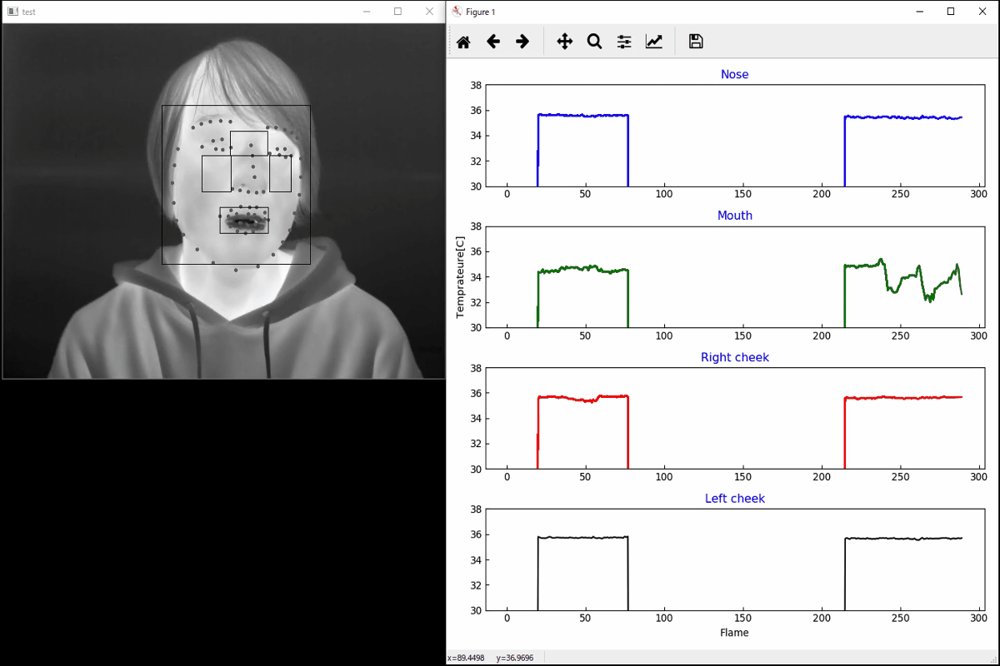
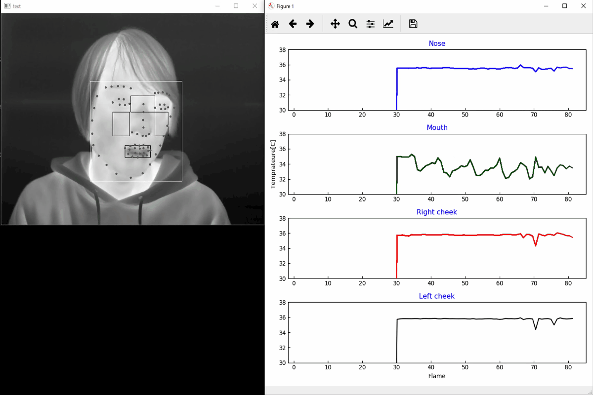

# 自己紹介
名前 : 小林 友洋  (Kobayashi Tomohiro)  
Email : tomohiro.kobayashi.fg@gmail.com  
住所 : Japan kanagawa  
勤務地 : FUJIFILM Business Innovation Corp.  
ソフトウェアエンジニア歴 : 4年

## 技術スタック

    
    
    
    
    
    

    
    
    
    

    
    
    

## 資格

    
    
    
    
    

## 経歴
|年|部署|業務概要|
|---|---|---|
|2019年4月|入学 青山学院大学 大学院|理工学専攻 生体情報に関する研究|
|2021年4月|入社 富士フイルムビジネスイノベーション株式会社|研修|
|2021年6月|配属 EDS事業本部 ソリューション基盤開発G|MPS Guardiaのバグ修正(AR対応) / テストを担当|
|2022年10月|部署名変更 BSS事業本部 ソリューション基盤開発G|MPS Guardiaの機能開発 / 複合機サービスのテストを担当|
|2024年4月|部署名変更 BS事業本部 ソリューション基盤開発G|MPS Guardiaの機能開発 / IT Expert Servicesの開発を担当|
|2025年4月|異動 BS事業本部 ネットワークサービス開発G|MPS Guardiaの機能開発 / IT Expert Servicesの開発を担当|

**[開発担当商品]**
- [MPS Guardia](https://www.fujifilm.com/fb/product/software/mps_guardia)
- [IT Expert Services](https://www.fujifilm.com/fb/product/software/it_expt_svs)
- [複合機サービス](https://www.fujifilm.com/fb/support/mf_manage/mf_service)

# 職務経歴
- 職務要約   
業務では、[MSP](https://e-words.jp/w/MSP.html)サービスであるMPS Guardiaのテスト、機能開発、品質向上、およびAWSコスト削減活動に従事し、技術選定から実装、さらにテスト自動化ツールの導入まで幅広い役割を担いました。また、IT Expert Servicesの立ち上げに際し、国内代理店がない海外SaaS製品の導入支援に取り組み、新たなサービスや技術の推進に貢献しました。さらに、若手の技術力向上を目的としたボトムアップ型の社内ハッカソンを自ら提案・実現しました。ハッカソンでは、生成AIを組み込んだWebアプリの開発を通じて革新的なアイデアを提案し、チームや組織に新たな価値をもたらしました。これらの活動を通じて培った課題提案力と解決力を活かし、チームへの貢献を続けています。 

## IoTデバイスから連携されるデータのフィルタリング機能の開発
- 期間 2024/11 - 2025/03

### 担当業務  
- 基本設計
- 詳細設計
- 技術選定
- 実装
- 単体テスト
### 業務内容
複合機から連携される障害/消耗品情報に対し、任意の設定に基づいて後続システムに連携処理判定を実施するフィルター機能の開発を担当。

### 使用技術
[言語]
- python

[AWS]
- AWS kinesis stream
- Amazon Managed Service for Apache Flink
- Amazon Aurora(MySQL)
- Amazon Elasticache
- Amazon DynamoDB
- Amazon S3
- Amazon SQS
- AWS Lambda

# 大学院 研究内容

## 生体計測・感性工学に関する研究
### 修論タイトル：熱画像における点群統計モデルを用いた顔面皮膚温度のリアルタイムセンシング

顔面皮膚温度は、人体の健康状態や眠気の判定において有用な指標となる。しかし、特定の顔面部位の温度をリアルタイムで取得する技術は未確立であり、実用化には多くの課題が存在していた。特に、サーモグラフィカメラによって取得された温度データを基に生成された二次元画像から、顔面の特徴を正確に抽出することが困難であった。
本研究では、機械学習およびディープラーニングを活用することで、顔面部位の特徴を高精度に検出するモデルを作成し、リアルタイムで特定部位の皮膚温度を計測する技術を確立した。本手法により、顔面皮膚温度の動的な変化をより精密に捉えることが可能となり、健康管理や睡眠研究において活用が期待される。

### 使用技術
- 機械学習
- ディープラーニング
- OpenCV

### Demo

    
    

