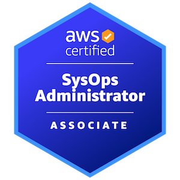

<h1> 自己紹介 </h1>

名前 : 小林 友洋 (Kobayashi Tomohiro)  
勤務 : FUJIFILM Business Innovation Corp.  
ソフトウェアエンジニア歴 : 4 年

<h2> 技術スタック </h2>

💻**プログラミング言語**

    
    
    
    
    
    

🛠️**フレームワーク/ライブラリ**

    
    
    
    

🗄️**データベース**

    
    
    

## 資格

    
    
    
    
    

## 経歴

<table style="">
    <thead>
      <tr style="background-color:#333c5e; color:#ffffff;">
        <th style="padding:10px; border:1px solid #778899;"></th>
        <th style="padding:10px; border:1px solid #778899;">キャリア</th>
        <th style="padding:10px; border:1px solid #778899;">業務概要</th>
      </tr>
    </thead>
    <tbody>
      <tr>
        <td style="padding:10px; border:1px solid #778899;">2021 年 3 月</td>
        <td style="padding:10px; border:1px solid #778899;">【卒業】 大学院</td>
        <td style="padding:10px; border:1px solid #778899;">理工学専攻 生体情報に関する研究</td>
      </tr>
      <tr style="background-color:;">
        <td style="padding:10px; border:1px solid #778899;">2021 年 4 月</td>
        <td style="padding:10px; border:1px solid #778899;">【入社】 富士フイルムビジネスイノベーション株式会社</td>
        <td style="padding:10px; border:1px solid #778899;">ソフトウェア開発部門に配属</td>
      </tr>
      <tr style="background-color:;">
        <td style="padding:10px; border:1px solid #778899;">🚩</td>
        <td style="padding:10px; border:1px solid #778899;">【現職】 富士フイルムビジネスイノベーション株式会社</td>
        <td style="padding:10px; border:1px solid #778899;">ネットワークサービス開発部門</td>
      </tr>
    </tbody>
  </table>

**[開発担当商品]**

- [MPS Guardia](https://www.fujifilm.com/fb/product/software/mps_guardia)
- [IT Expert Services](https://www.fujifilm.com/fb/product/software/it_expt_svs)

# 職務経歴

### 職務要約  
  業務では、[MSP](https://e-words.jp/w/MSP.html)サービスである MPS Guardia のテスト、機能開発、品質向上、および AWS コスト削減活動に従事し、技術選定から実装、さらにテスト自動化ツールの導入まで幅広い役割を担いました。また、IT Expert Services の立ち上げに際し、国内代理店がない海外 SaaS 製品の導入支援に取り組み、新たなサービスや技術の推進に貢献しました。さらに、若手の技術力向上を目的としたボトムアップ型の社内ハッカソンを自ら提案・実現しました。ハッカソンでは、生成 AI を組み込んだ Web アプリの開発を通じて革新的なアイデアを提案し、チームや組織に新たな価値をもたらしました。これらの活動を通じて培った課題提案力と解決力を活かし、チームへの貢献を続けています。

  <h2> IoT デバイスから連携されるデータのフィルタリング機能の開発 </h2>
  
期間 : 2024年11月 - 2025年3月

  <h3> 担当フェーズ </h3>

  要件定義 / 基本設計 / 詳細設計 / 実装 / 単体テスト

  <h3> 業務内容 </h3>

複合機から送信される障害情報および消耗品情報に対し、ユーザー設定に基づいて後続システムへの連携要否を判定するフィルタリング機能の開発を担当。要件定義から設計、実装、テストまで一貫して対応。
開発においてはテスト駆動開発（TDD）やデザインパターンを積極的に導入し、保守性・再利用性の高いコードを実現するとともに、品質向上に貢献した。

  <h3> 使用技術 </h3>

  [言語]  
  Python  
  [AWS]  
  AWS kinesis stream / Amazon Managed Service for Apache Flink / Amazon Aurora(MySQL) / Amazon Elasticache / Amazon DynamoDB / Amazon S3 / Amazon SQS / AWS Lambda

  <h2> 営業向けバックポータルシステムとのデータ連携機能の改修 </h2>
  
期間 : 2024年4月 - 2024年8月

  <h3> 担当フェーズ </h3>

  基本設計 / 詳細設計 / 実装 / 単体テスト

  <h3> 業務内容 </h3>

  営業向けバックポータルシステムとMPS Guardia間のデータ連携機能の改修を担当。営業システムが15分毎に生成するCSVファイルを、Amazon EMR上のバッチ処理を用いてMPS Guardiaで利用可能な形式に変換し、システム間連携を実現。基本設計から詳細設計、実装、単体テストまでの全工程を担当し、データ連携の安定性・保守性向上を図った。

  <h3> 使用技術 </h3>

  [言語]  
  Java  
  [フレームワーク/ライブラリ]
  Apache Spark
  [AWS]  
  Amazon EMR

  <h2> お客様向け月次pdfレポート生成機能の開発 </h2>

  
期間 : 2023年9月 - 2024年4月

  <h3> 担当業務 </h3>

  要求整理 / 要件定義 / 基本設計 / 詳細設計 / 実装 / 単体テスト

  <h3> 業務内容 </h3>

  担当サービスであるIT Expert Servicesの月次で提供しているpdfレポートを提供するためのデータ集計処理機能の実装を担当。

  <h3> 使用技術 </h3>

  [言語]  
  Python / Go / HTML / CSS / JavaScript

  [AWS]  
  Glue / Lambda / ECS / Athena / S3

  <h2> 営業支援向け生成AIサービスの企画・開発 </h2>

  
期間 : 2023年7月 - 2024年3月

  <h3> 担当業務 </h3>

  企画 / 要求整理 / 要件定義 / 基本設計 / 詳細設計 / 実装

  <h3> 業務内容 </h3>

  社内ハッカソンにて、営業担当者の業務効率化を目的とした生成AIを活用した営業支援サービスの開発を担当しました。本サービスは、1人あたり約200件の案件を抱える営業担当者が、顧客訪問の直前に当該顧客の情報や過去の提案内容などを簡単に把握できるように、要点を自動で要約・提示する機能を提供するものです。生成AIによるチャットアプリケーションを構築し、さらに社内に蓄積された顧客情報や提案履歴などを活用したRAG（Retrieval-Augmented Generation）を組み合わせることで、より精度の高い情報提供を実現しました。

  社内規則により外部の生成AIサービスの利用が制限されていたため、AWSのローカル環境上にOSSとして公開されている大規模言語モデル「Ollama2」を構築し、ローカル環境内で完結する形で生成AI機能を実装しました。一部機能に関して導入を検討しています。

  <h3> 使用技術 </h3>

  [言語]  
  Python / HTML / CSS / JavaScript

  [フレームワーク/ライブラリ]  
  React / Material UI

  [AWS]  
  Kendra/ RDS / Lambda / API Gateway / Cognito / EC2 / S3 / Amplify 

  <h2> MPS Guardiaのクライアントツールで設定するパラメータを暗号化するexeファイルの実装 </h2>

  
期間 : 2022年10月 - 2023年1月

  <h3> 担当業務 </h3>

  実装 / 単体テスト

  <h3> 業務内容 </h3>

  TBD

  <h3> 使用技術 </h3>

  [言語]  
  Go

  <h2> 複合機のジョブデータを暗号化しデータを圧縮するバッチの開発 </h2>

  
期間 : 2021年7月 - 2021年10月

  <h3> 担当業務 </h3>

  実装 / 単体テスト

  <h3> 業務内容 </h3>

  TBD

  <h3> 使用技術 </h3>

  [言語]  
  Windows Batch

# 大学院 研究内容

## 生体計測・感性工学に関する研究

### 修論タイトル：熱画像における点群統計モデルを用いた顔面皮膚温度のリアルタイムセンシング

顔面皮膚温度は、人体の健康状態や眠気の判定において有用な指標となる。しかし、特定の顔面部位の温度をリアルタイムで取得する技術は未確立であり、実用化には多くの課題が存在していた。特に、サーモグラフィカメラによって取得された温度データを基に生成された二次元画像から、顔面の特徴を正確に抽出することが困難であった。
本研究では、機械学習およびディープラーニングを活用することで、顔面部位の特徴を高精度に検出するモデルを作成し、リアルタイムで特定部位の皮膚温度を計測する技術を確立した。本手法により、顔面皮膚温度の動的な変化をより精密に捉えることが可能となり、健康管理や睡眠研究において活用が期待される。

### 使用技術
[言語]  
Python  
[その他]  
機械学習 / ディープラーニング / OpenCV

### Demo

    
    

